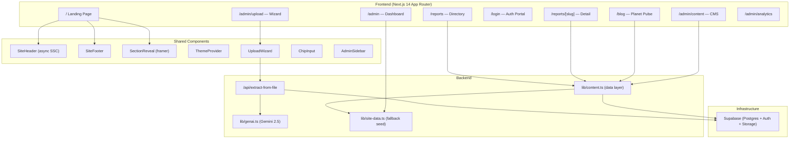

# CoSET Intelligence Hub — Codebase Analysis & Optimization Plan

## Architecture Overview

---

## File Inventory

| File | Lines | Purpose |
|------|------:|---------|
| [page.tsx](file:///c:/dev/coset-intel-hub/app/page.tsx) | 273 | Landing page — hero, featured reports, blog grid, newsletter, org links |
| [reports/page.tsx](file:///c:/dev/coset-intel-hub/app/reports/page.tsx) | 205 | Reports directory with sidebar filters, FAQ, org links |
| [reports/[slug]/page.tsx](file:///c:/dev/coset-intel-hub/app/reports/%5Bslug%5D/page.tsx) | 180 | Individual report view with metrics, related reports |
| [blog/page.tsx](file:///c:/dev/coset-intel-hub/app/blog/page.tsx) | 82 | Blog listing with featured post + sidebar |
| [login/page.tsx](file:///c:/dev/coset-intel-hub/app/login/page.tsx) | 180 | Premium login portal with Supabase auth |
| [admin/page.tsx](file:///c:/dev/coset-intel-hub/app/admin/page.tsx) | 113 | Admin dashboard with KPI cards, activity table |
| [admin/content/page.tsx](file:///c:/dev/coset-intel-hub/app/admin/content/page.tsx) | 106 | Content management table (RBAC-aware) |
| [admin/upload/page.tsx](file:///c:/dev/coset-intel-hub/app/admin/upload/page.tsx) | ~12 | Upload wizard page wrapper |
| [api/extract-from-file/route.ts](file:///c:/dev/coset-intel-hub/app/api/extract-from-file/route.ts) | 225 | AI extraction pipeline (file → Gemini → Supabase) |
| [lib/content.ts](file:///c:/dev/coset-intel-hub/lib/content.ts) | 337 | Data access layer with Supabase + fallback logic |
| [lib/site-data.ts](file:///c:/dev/coset-intel-hub/lib/site-data.ts) | 190 | Static seed data (reports, blog, admin stats) |
| [lib/genai.ts](file:///c:/dev/coset-intel-hub/lib/genai.ts) | 86 | Gemini 2.5 Flash extraction prompt |
| [lib/supabase/clients.ts](file:///c:/dev/coset-intel-hub/lib/supabase/clients.ts) | 78 | Supabase client factories (public/admin/server) |
| [components/upload-wizard.tsx](file:///c:/dev/coset-intel-hub/components/upload-wizard.tsx) | 464 | 3-step upload wizard with AI metadata extraction |
| [components/site-header.tsx](file:///c:/dev/coset-intel-hub/components/site-header.tsx) | 102 | Async server component header with auth state |
| [components/site-footer.tsx](file:///c:/dev/coset-intel-hub/components/site-footer.tsx) | 172 | Footer with newsletter CTA + link groups |

---

## Strengths

| Area | Details |
|------|---------|
| **Design System** | Robust CSS variable theming (light/dark), custom Tailwind color tokens (`ink`, `navy`, `teal`, `ember`, etc.), editorial shadows |
| **AI Pipeline** | Clean Gemini 2.5 integration for extracting metadata from uploaded docs, with graceful fallback |
| **Auth & RBAC** | Server-side Supabase auth with role-based access (`admin`, `editor`, `viewer`), profile-aware UI |
| **Resilient Data Layer** | Every data function gracefully falls back to static seed data when Supabase is unavailable |
| **Visual Quality** | Premium editorial aesthetic — glassmorphism hero, `framer-motion` reveals, dark mode support |
| **Type Safety** | Generated Supabase types ([database.types.ts](file:///c:/dev/coset-intel-hub/lib/database.types.ts)) for end-to-end type safety |

---

## Issues & Optimization Opportunities

### 🔴 Critical

| # | Issue | Location | Impact |
|---|-------|----------|--------|
| 1 | **`dangerouslySetInnerHTML` without server-side sanitization** | [reports/[slug]/page.tsx:89](file:///c:/dev/coset-intel-hub/app/reports/%5Bslug%5D/page.tsx#L89) | XSS vulnerability — `html_content` from DB rendered raw. `dompurify` is in deps but never imported/used server-side |
| 2 | **No middleware auth guard** | Admin routes | Admin pages are accessible without auth — the CMS renders fallback data instead of redirecting. No `middleware.ts` for protected routes |
| 3 | **`public/stitch` — 5.13 MB of unused static HTML** | [public/stitch/](file:///c:/dev/coset-intel-hub/public/stitch) | 13 directories of raw wireframe HTML shipped to production. These were design references (per PRD) and should not be deployed |

### 🟡 Performance

| # | Issue | Location | Impact |
|---|-------|----------|--------|
| 4 | **Homepage uses static seed data, not Supabase** | [app/page.tsx:8](file:///c:/dev/coset-intel-hub/app/page.tsx#L8) | Imports directly from `site-data.ts` instead of `content.ts`, so the landing page never shows live DB reports |
| 5 | **Admin dashboard uses static seed data** | [admin/page.tsx:4](file:///c:/dev/coset-intel-hub/app/admin/page.tsx#L4) | `adminStats` and `adminActivity` are hardcoded — should query Supabase for real KPIs |
| 6 | **Report detail fetches ALL reports for "related"** | [reports/[slug]/page.tsx:26](file:///c:/dev/coset-intel-hub/app/reports/%5Bslug%5D/page.tsx#L26) | Calls `getPublishedReports()` then filters — should use a targeted Supabase query |
| 7 | **No image optimization strategy** | Multiple pages | Several `<Image>` tags without `sizes` prop; images not served from Supabase storage CDN |
| 8 | **`SiteHeader` is an async Server Component calling `auth.getUser()` on every render** | [site-header.tsx](file:///c:/dev/coset-intel-hub/components/site-header.tsx) | Adds latency to every page load. Could cache or use middleware to pass auth state |
| 9 | **Duplicate `min-height: 100vh`** | [globals.css:42-43](file:///c:/dev/coset-intel-hub/app/globals.css#L42-L43) | Minor — duplicated line |

### 🟡 Functionality Gaps

| # | Issue | Location | Impact |
|---|-------|----------|--------|
| 10 | **Filters are non-functional (decorative only)** | Reports page & home page | Checkboxes and "Apply Filters" / "Export Data" buttons are static — no client-side filtering logic |
| 11 | **Search is non-functional** | Header search bar | No search implementation despite `search_vector` column existing in DB |
| 12 | **Grid/List view toggle is decorative** | [reports/page.tsx:44-45](file:///c:/dev/coset-intel-hub/app/reports/page.tsx#L44-L45) | Buttons exist but no toggling logic |
| 13 | **Download PDF button is non-functional** | Report detail + listing | No actual PDF generation or download link |
| 14 | **Newsletter subscription form is decorative** | Footer + blog sidebar | No submit handler or API integration |
| 15 | **No `officeparser` / `pdf-parse` usage** | API route | Only plain-text files are extracted (`canExtractText`). PPT/DOCX/PDF parsing is listed in deps and PRD but not implemented |
| 16 | **No cover image upload** | Upload wizard | The "Featured Image" section is static placeholder text — no upload mechanism |
| 17 | **Blog posts have no individual detail page** | `/blog` route | Blog cards are not clickable links to detail pages |

### 🔵 Code Quality

| # | Issue | Location | Impact |
|---|-------|----------|--------|
| 18 | **Large monolithic page components** | `app/page.tsx` (273 lines), `upload-wizard.tsx` (464 lines) | Should be decomposed into smaller, focused components |
| 19 | **`dompurify` installed but unused** | `package.json` | Listed as a dep for sanitization but never imported |
| 20 | **Missing error boundary coverage** | Global `error.tsx` exists but no route-level boundaries | Admin/API errors may bubble up unhandled |
| 21 | **Hardcoded breadcrumb text** | [reports/[slug]/page.tsx:45](file:///c:/dev/coset-intel-hub/app/reports/%5Bslug%5D/page.tsx#L45) | "Nigeria 2024" is hardcoded in the breadcrumb trail |
| 22 | **No loading states for data-fetching pages** | Reports, Blog, Content pages | No `loading.tsx` skeletons for ISR pages |

---

## Recommended Optimization Priorities

### Phase 1 — Security & Cleanup (immediate)

1. **Sanitize `html_content`** — Import `dompurify` (with `jsdom` for server-side) in the report detail page to sanitize AI-generated HTML before rendering
2. **Add auth middleware** — Create `middleware.ts` to protect `/admin/*` routes and redirect unauthenticated users to `/login`
3. **Remove `public/stitch/`** — Delete 5.13 MB of unused wireframe HTML from production bundle, or add to `.gitignore`

### Phase 2 — Connect Live Data (high impact)

4. **Wire homepage to `content.ts`** — Replace static imports with `getPublishedReports()` and `getPublishedBlogPosts()`
5. **Wire admin dashboard to Supabase** — Create aggregate queries for real KPIs (total reports, views, downloads)
6. **Implement `officeparser` + `pdf-parse`** — Enable the PRD-specified document parsing pipeline for PDF/DOCX/PPTX

### Phase 3 — Functional Completions (user-facing)

7. **Client-side report filtering** — Convert reports page to use `'use client'` filter state with URL search params
8. **Implement search** — Wire the header search to Supabase's `search_vector` column (full-text search)
9. **Add blog detail pages** — Create `/blog/[slug]/page.tsx`
10. **Add loading skeletons** — Create `loading.tsx` for reports, blog, and admin routes

### Phase 4 — Performance Polish

11. **Optimize related reports query** — Add a dedicated `getRelatedReports(slug, category)` function
12. **Add `sizes` prop to `<Image>` tags** — Improve responsive image loading
13. **Decompose large components** — Break up homepage and upload wizard into smaller pieces

---

> [!TIP]
> The codebase is well-structured and the design system is mature. The biggest wins come from **connecting live Supabase data** to the static pages and **enabling the document processing pipeline** that's already defined in the PRD but not fully implemented.
